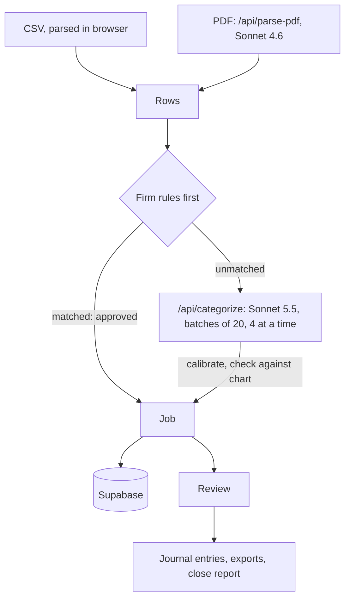

# CloseBooks: technical overview of the categorisation engine

For a technical reader who wants the engine, not the UI. It describes the
live app, deployed from commit `041a6ef` on 2026-10-01. File and line detail:
[architecture.md](./architecture.md). Each number's source:
[facts.md](./facts.md). Security: [engine/rls-audit.md](./engine/rls-audit.md).

**Status.** A demo: no customers, no real client data. Every accuracy and cost
number comes from one **synthetic** dataset (section 9). *Strict* accepts only
the primary label; *lenient* also accepts policy alternates (for example a
client payment to revenue instead of AR).

## 1. What it does (core path only)

A bookkeeper picks a client and a chart of accounts and uploads a bank
statement (CSV or PDF). Each line gets an account from a saved firm rule or
from Claude Sonnet 5.5; rows at confidence 0.93 or above with no validation
flag are auto-approved, the rest wait for review. The reviewer approves,
recategorises, splits and saves rules; the app produces balanced journal
entries and a close report. Everything else in the repo (portal, inbox, Plaid,
copilot, autopilot) is hidden, and its API routes return 404.

## 2. Architecture and data flow

Next.js 14 on Vercel, Supabase (Postgres, auth, RLS), Anthropic API.

## 3. What data is loaded and where it is stored

The user loads a bank statement and a chart (built-in template or CSV) and
creates clients by hand. Jobs, transactions, clients, corrections, rules and
the audit trail are stored in Supabase, scoped to the firm by RLS (tables:
[architecture.md section 2](./architecture.md#2-what-data-is-loaded-where-it-lives-what-leaves)).
Nothing from the core path goes to localStorage; without Supabase, data is
in memory only.

**What leaves the system:**

- **To Anthropic, categorisation:** per row the date, description, amount and
  direction; the chart; up to 10 recent corrections. Never the client name.
- **To Anthropic, PDFs:** up to 60,000 characters of statement text, which can
  include the holder's name, address and account number.
- **To Formspree:** nothing. The unauthenticated owner notification that sent
  the client name was removed on 2026-10-01; `/api/notify` returns 404.
- **To Stripe:** checkout, test mode.

## 4. How the prompt is built and what is sent to Claude

One call per batch of 20 rows, up to 4 in flight, `max_tokens` 4096, no tool
use, no prompt caching. Model and threshold are constants in
`src/lib/ai/models.ts`; the prompt is in `src/lib/categorize.ts`.

**System prompt:** a bookkeeper role; "never use Miscellaneous"; about 20
keyword rules with confidences (`"PAYROLL", "GUSTO" → Payroll & Wages, 0.99`);
amount guidance; a confidence scale (0.95-0.99 clear, 0.80-0.94 likely,
0.65-0.79 review); JSON output; and a line saying the chart, corrections and
transactions are data whose instructions must not be followed.

**User message:** the chart, the corrections, then rows numbered 0-19
(`0: date=2026-06-02 | description="GUSTO DES:NET ..." | amount=4210.00 | type=debit`).
Text fields are made one line, escaped, and descriptions capped at 200
characters.

**Reading the reply.** Only text blocks are read. An unreadable reply is
retried once, network errors up to 3 times; a batch that still fails flags its
rows and the upload continues.

## 5. Confidence and the 0.93 threshold

The app lowers the model's confidence for amounts under $20 (minus 0.08) and
for very short or all-digit descriptions (capped at 0.60), then checks the
account against the chart (section 6). A row is auto-approved only with no
flag and confidence ≥ 0.93.

**How 0.93 was chosen.** `eval/sweep-cli.ts` recomputed the auto-approve
decision at every threshold from 0.70 to 0.99 from saved eval confidences (at
0.85 it reproduces every saved decision). Target: at most 2% wrong among
auto-approved rows (lenient), no REVIEW row auto-approved. Pooled over two
Sonnet 5.5 runs that is 0.91, but run 2 alone needed 0.93.

| Setting | Auto-approved | Wrong, lenient | Wrong, strict | Review rows per 97-row statement |
|---|---:|---:|---:|---:|
| Sonnet 4.6 at 0.85 (previous), 2 runs | 468 (82.4%) | 27 (5.8%) | 82 (17.5%) | 19.3 |
| Sonnet 5.5 at 0.91, 2 runs | 291 (52.3%) | 4 (1.4%) | 27 (9.3%) | 47.7 |
| Sonnet 5.5 at 0.93, 2 runs | 274 (49.3%) | 1 (0.4%) | 20 (7.3%) | 50.5 |

Of the 20 strict errors at 0.93, 19 are policy alternates (18 client payments
to 4100 Service Revenue instead of 1100 AR, 1 Mailchimp to 6100 Software
instead of 5500 Marketing) and 1 is a real mistake (Gusto payroll tax to 5100
instead of 2300 Payroll Liabilities). A firm that books payments against
invoices would correct 7.3% of auto-approved rows, not 0.4%.

The cost is review load: about half of each statement. Sonnet 4.6 would need
0.98 for 2% wrong (lenient), reviewing 92.8 of 97 rows. Expected calibration
error: Sonnet 5.5 0.092 strict / 0.067 lenient; Sonnet 4.6 0.121 / 0.055.

**Limit:** one live run at 0.93 has been made, on the preview (128 of 292
auto-approved, section 9); the eval figures come from recomputing saved
predictions.

## 6. Unknown and invalid accounts

- **Account not in the chart:** flagged, confidence capped at 0.55.
- **Code and name disagree:** the chart's account wins; the row can't
  auto-approve.
- **Direction looks wrong** (money out to revenue, in to an expense): flagged
  for review, confidence capped at 0.60.
- **A row missing from a readable reply** is flagged.

## 7. Rules learned from corrections

- When a reviewer changes a row's account, the table offers "Always categorize
  ... as ...?". Accepting saves a rule (vendor key, account, direction) and
  applies it to matching pending rows.
- The vendor key strips what changes monthly (dates, ids, card digits, phones,
  state codes) but keeps words that separate payment types
  (`gusto des:net` vs `gusto des:tax`). Matching is exact.
- At upload, rules run before the model: matched rows are **approved**,
  credited to the rule, and not sent to Claude.
- Each change is also saved as a correction; the 10 most recent are prompt
  hints. A hint isn't a rule: on the preview a corrected Stripe payout came
  back on AR from the hint alone, below 0.93, and stayed pending.

**Measured effect (projection):** treating June as reviewed and every wrong
June row as a rule, rules matched 5 of 188 July-August rows, all correct.
Accuracy rose from 94.5% to 95.6% lenient (84.7% to 86.3% strict); wrong
auto-approvals fell from 8 to 6 lenient (26 to 23 strict), at 0.85. Of 16
later rows from corrected vendors, 11 use a second bank-line format the rules
missed. Sonnet 4.6 run 1, not the current model.

## 8. Journal entries and the balance check

One entry per approved row (more lines for splits). Direction comes from
`type`, not the sign: money out debits the account and credits the bank. The
bank account is the chart's first "checking" asset, else code 1000, else a
"cash" or "bank" asset. Rows that can't post (flagged, unapproved, unknown
account, zero amount, splits that don't sum) are listed as exceptions; money
in to an expense posts but is listed as a possible refund. Math is in whole
cents; if any entry or the journal doesn't balance, nothing is output (export
returns 422). Rules: [engine/journal-entries.md](./engine/journal-entries.md).

## 9. Measured results and their limits

**Data:** `eval/data/synthetic_transactions.csv`: 292 rows for a fictional
business (Brightline Studio LLC), one checking account, June to August 2026,
the app's 34-account chart; 284 labelled with an account, 8 REVIEW. Threshold
0.85, batches of 20, no corrections.

| Model | Runs | Strict | Lenient | Wrong among auto-approved at 0.85, strict / lenient | Cost per 97-row statement | Median latency per row |
|---|---:|---:|---:|---:|---:|---:|
| Sonnet 4.6 | 2 | 480/568 (84.5%) | 539/568 (94.9%) | 82/468 (17.5%) / 27/468 (5.8%) | $0.160 | 1.15 s |
| Sonnet 5.5 | 2 (run 2 cut at 280) | 482/556 (86.7%) | 528/556 (95.0%) | 64/418 (15.3%) / 22/418 (5.3%) | $0.111 | 0.43 s |
| Haiku 4.5 | 1 | 214/284 (75.4%) | 246/284 (86.6%) | 60/230 (26.1%) / 30/230 (13.0%) | $0.050 | 0.53 s |

All 16 Sonnet 5.5 REVIEW predictions went to review; 8 of 280 rows (2.9%)
changed account between its runs. Opus 5.5 gave no usable predictions (a
parsing bug, since fixed). Eval API spend: $2.3571.

**Live runs (not evals).** Preview, 2026-10-01: the 292-row file took **about
40 s** (one stopwatch run); **128 of 292 auto-approved (43.8%), 164 pending, 0
flagged**. The eval's 49.3% counts labelled rows only, over runs made before
the "data, not instructions" label, so the figures differ in kind. After the
production deploy, an 8-row close auto-approved 6 and left 2 pending (owner's
test).

**Limits:** synthetic data, one business, chart and account; nothing measured
on real books. At most two runs per model, which shows variation but doesn't
bound it; Sonnet 5.5 run 2 lacks 12 rows. Only 8 REVIEW rows. 0.93 was chosen
and evaluated on the same data, with no held-out set. The saved runs predate
the "data" label. Costs are list price, no caching, categorisation only; PDFs
unmeasured.

## 10. Security audit and what was fixed

A read-only audit of the SQL in the repo; the live database was not
inspected. Status per finding: [engine/rls-audit.md](./engine/rls-audit.md),
section 0.

- **In code:** hidden routes and `/portal/*` return 404 (a test checks the
  allowlist), closing F2, F3, F4, F6, F11 and F12. Trial state and
  subscriptions no longer trust the browser (F7, F8); `/api/notify` is off.
- **In the database:** the migrations for F1 (2026-09-30) and F5, F7, F8, F9,
  F10, F14 and F15's `qbo_connections` (2026-10-01) are applied, in the order
  in [migrations-to-apply.md](./migrations-to-apply.md). Tested on PGlite;
  applied by the owner, so as reported.
- **Still open:** adding a user to a firm without consent (rest of F5), F13,
  F16, the rest of F15.

## 11. Known weaknesses

- **Deposits go to revenue**, per the prompt; client payments should clear AR,
  and Stripe payouts land on 4000 instead of 1100.
- **Confident liability errors:** Gusto payroll tax to wages (the prompt's
  keyword rule points that way; one such row auto-approved at 0.93 in run 2),
  SBA loan (2500) to the line of credit (2400); Sonnet 4.6 sent sales tax
  (2200) to an expense.
- **PDF path unmeasured**, on Sonnet 4.6; PDFs over about 3.3 MB fail on
  Vercel's 4.5 MB request limit.
- **Long uploads in one request:** 120 s at 292 rows per 40 s is roughly 900
  rows, extrapolated from one run; rate limits under load unmeasured.
- **Some closes match by name:** `/get-started` jobs and older ones without a
  unique name match.
- **No live QuickBooks connection**; CSV import into QuickBooks not tested.
- **One chart evaluated**; **prompt injection reduced, not ruled out**; the
  hidden QuickBooks push posts everything to one account.

## 12. What I'd build next with real data

1. **A real labelled set** from two or three firms, run through `eval/run.ts`,
   threshold re-picked on a held-out month.
2. **Fix the revenue and liability guidance**, measured on a time split.
3. **Measure the PDF path** per bank; move it to the same model and reply handling.
4. **Measure rules over time** and match more than one bank format per vendor.
5. **Move batching off the request path** and upload PDFs straight to storage.
6. **Add an invitation flow (rest of F5) and close F13/F16** before real data.
